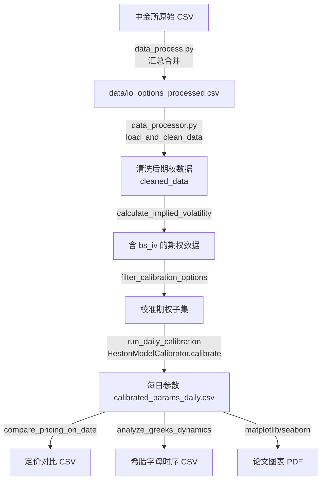
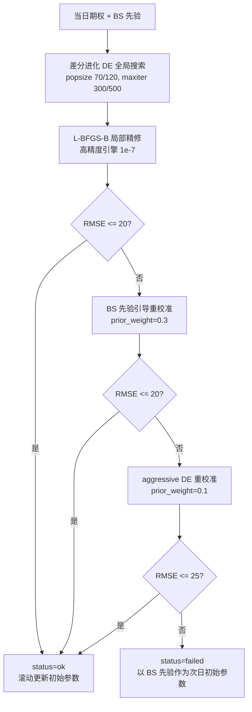
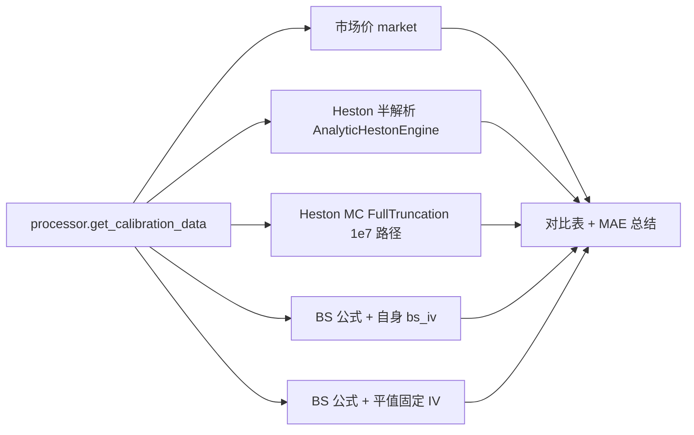
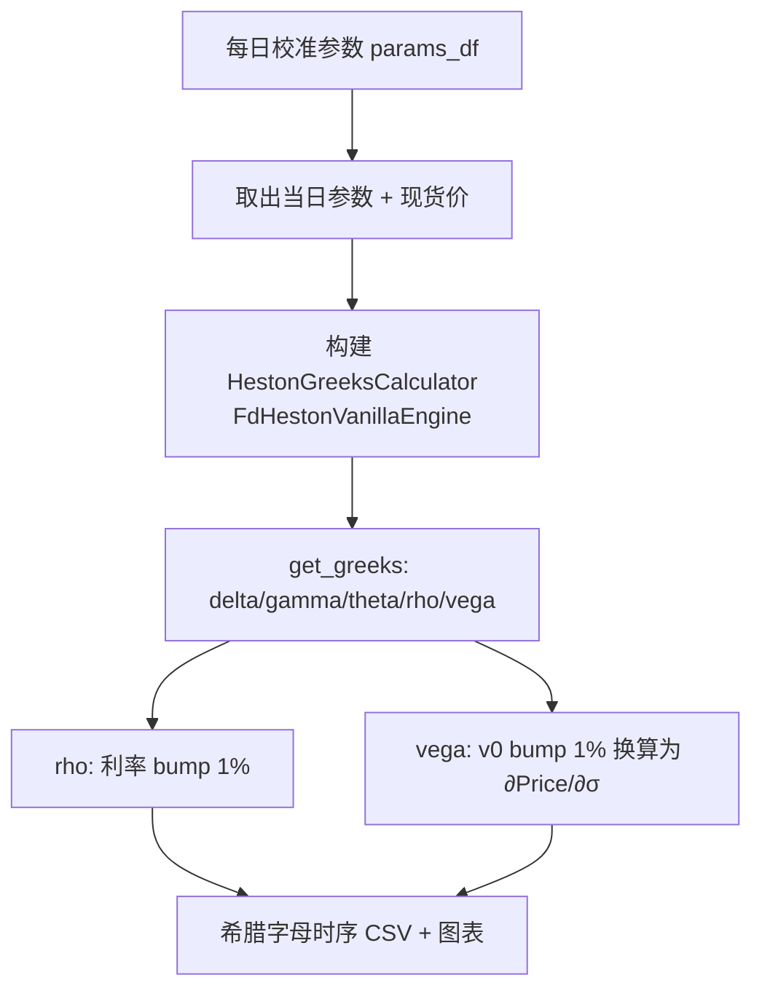

# project_design.md — 设计辅助文档（流程图 / ER 图）

> 依据 `code/AGENTS.md` 要求生成的软件工程设计辅助文档。
> 流程图与 ER 图从 `summary_proj.md` 中独立出来，便于单独维护；项目整体说明见 `summary_proj.md`。

## 1. 流程图

### 1.1 总体数据处理与校准流程图



### 1.2 单日校准（两阶段优化 + 回退策略）



### 1.3 定价验证流程图



### 1.4 希腊字母分析流程图



## 2. ER 图（数据实体关系）

```mermaid
erDiagram
    交易日 ||--o{ 期权记录 : "包含(1:N)"
    交易日 ||--o{ 校准参数 : "生成(1:1)"
    期权记录 ||--o{ 定价对比 : "验证(1:N)"
    期权记录 ||--o{ 希腊字母记录 : "计算(1:N)"

    交易日 {
        date PK
    }
    期权记录 {
        date FK
        string 合约代码 PK
        float strike
        string cp
        float close
        float volume
        float open_interest
        float delta
        date expiry
        float T
        float bs_iv
    }
    校准参数 {
        date FK
        float v0
        float kappa
        float theta
        float sigma
        float rho
        float rmse
        float mae
        string status
    }
    定价对比 {
        date FK
        float strike
        string type
        float market
        float BlackScholes
        float BS_const
        float Heston_analytic
        float Heston_MC
    }
    希腊字母记录 {
        date FK
        float strike
        float delta
        float gamma
        float theta
        float rho
        float vega
        float spot
    }
```

说明：期权记录（`io_options_processed.csv`）是核心实体；每个交易日由校准流程产出唯一一组 `calibrated_params_daily.csv` 参数；定价对比与希腊字母记录均派生自期权记录与校准参数。
