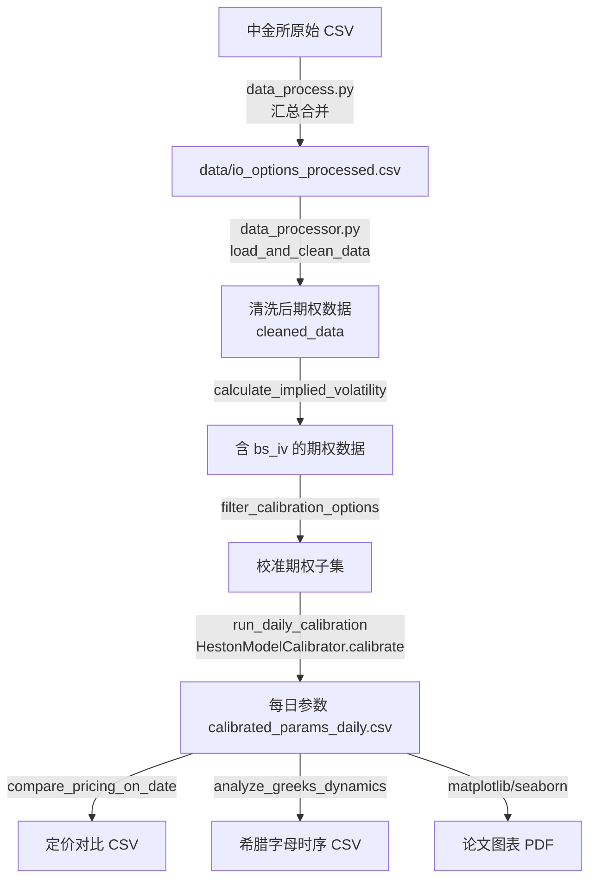
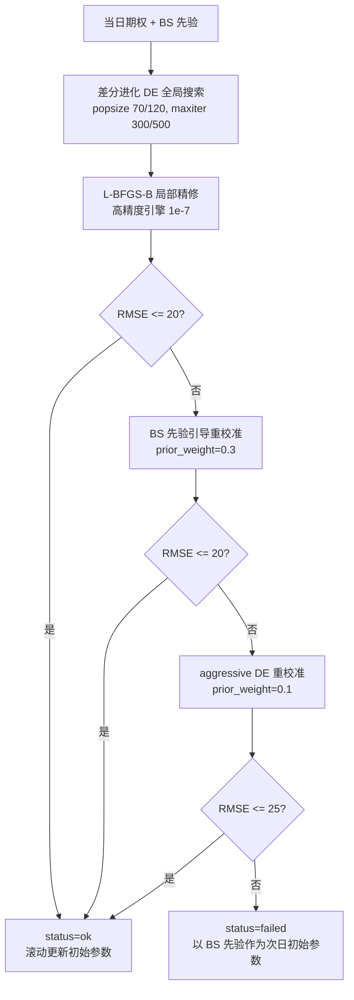
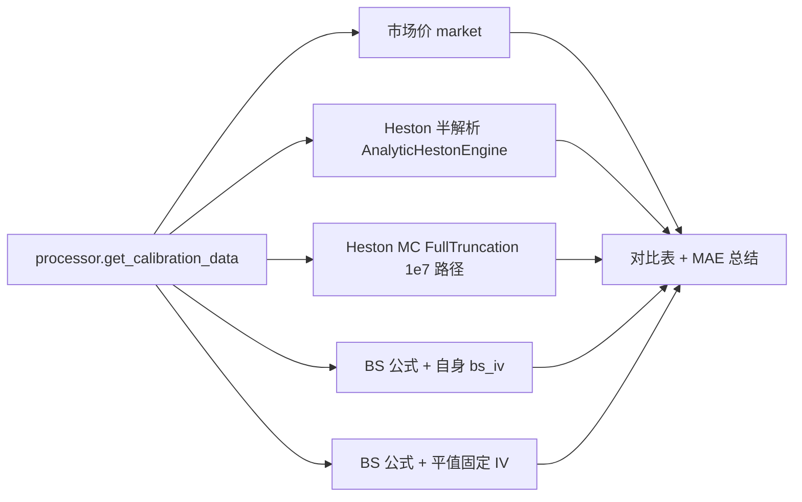
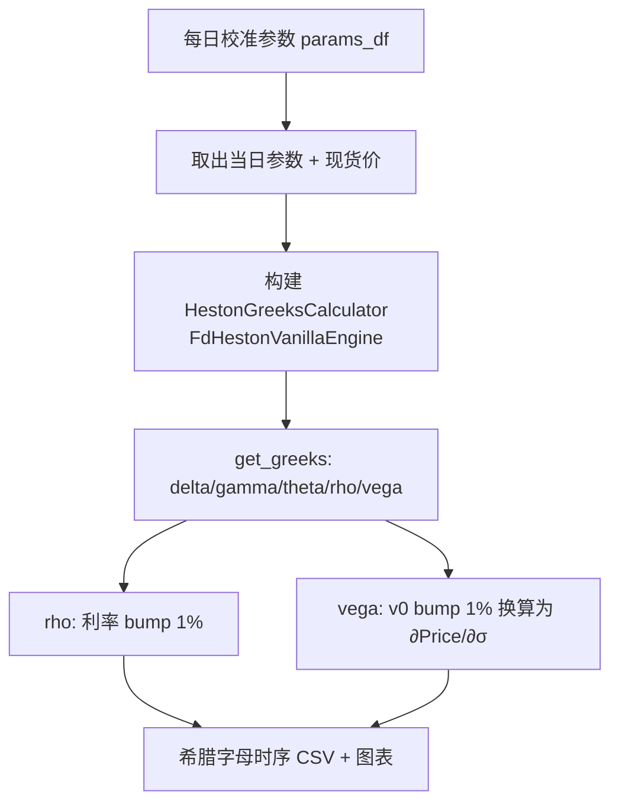

# project_design.md — 设计辅助文档（流程图）

> 依据 `code/AGENTS.md` 要求生成的软件工程设计辅助文档。
> 流程图从 `summary_proj.md` 中独立出来，便于单独维护；项目整体说明见 `summary_proj.md`。

## 1. 流程图

### 1.1 总体数据处理与校准流程图

### 1.2 单日校准（两阶段优化 + 回退策略）

### 1.3 定价验证流程图

### 1.4 希腊字母分析流程图

